

# Uniqon

## 📚 서비스 소개

- 웹 3.0은 사용자 중심의 인터넷 환경으로, 개인화된 서비스와 데이터의 소유권이 강조됩니다. 이러한 환경에서 **NFT (Non-Fungible Token)** 는 디지털 자산의 고유성과 소유권을 증명할 수 있는 기술로 주목받고 있습니다.
- 이러한 배경에서 시작한 저희의 **희귀동물 NFT 거래 플랫폼**은 본인이 소유한 희귀동물을 NFT로 발행하여 거래함으로써, 디지털 컨텐츠의 가치를 높일 수 있으며,희귀동물의 보호와 관리에 대한 관심을 높이고, 생태계를 활성화할 수 있습니다. 또한, 블록체인 기술을 활용하여 신뢰성을 높일 수 있습니다.

## 🙎🏻‍♂️🙎🏻‍♀️ 팀원 소개

### Front-End

<table align="center">
    <tr align="center">
        <td style="min-width: 150px;">
            <a href="https://github.com/JeBread">
              
               
              <b>방상제</b>
            </a>
        </td>
        <td style="min-width: 150px;">
            <a href="https://github.com/ji-hyon">
              
               
              <b>서지현</b>
            </a> 
        </td>
        <td style="min-width: 150px;">
            <a href="https://github.com/cjjss11">
            
               
              <b>최지수</b>
            </a> 
        </td>
    </tr>
    <tr align="center">
        <td>
            방상제 [Design]
        </td>
        <td>
            서지현 [DID]
        </td>
        <td>
            최지수 [Design]
        </td>
    </tr>
</table>

### Back-End

<table align="center">
    <tr align="center">
        <td style="min-width: 150px;">
            <a href="https://github.com/kmr5326">
              
               
              <b>김한결</b>
            </a>
        </td>
        <td style="min-width: 150px;">
            <a href="https://github.com/asdqwe45">
              
               
              <b>이재명</b>
            </a> 
        </td>
        <td style="min-width: 150px;">
            <a href="https://github.com/cutepassion">
              
               
              <b>진병욱</b>
            </a> 
        </td>
    </tr>
    <tr align="center">
        <td>
            김한결 [NFT]
        </td>
        <td>
            이재명 [AI]
        </td>
        <td>
            진병욱 [DID]
        </td>
    </tr>
</table>

## 🗓 개발 기간

- 2023.08.23 ~ 10.06 (6주)

## 💻 사용 서버

### 웹 서버

- AWS Lightsail ($80)

### Front-End

- React

### Gateway

- Nodejs

### Back-End

- Spring Boot

### AI

- FastAPI

## 🛠 사용 기술 및 라이브러리

### Front-End

### Back-End

## ERD

### Uniqon

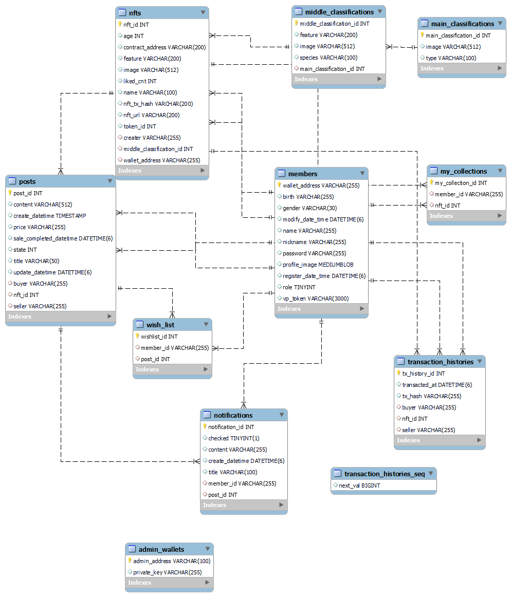

### Diti

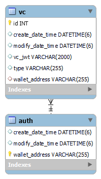

## 시스템 아키텍처

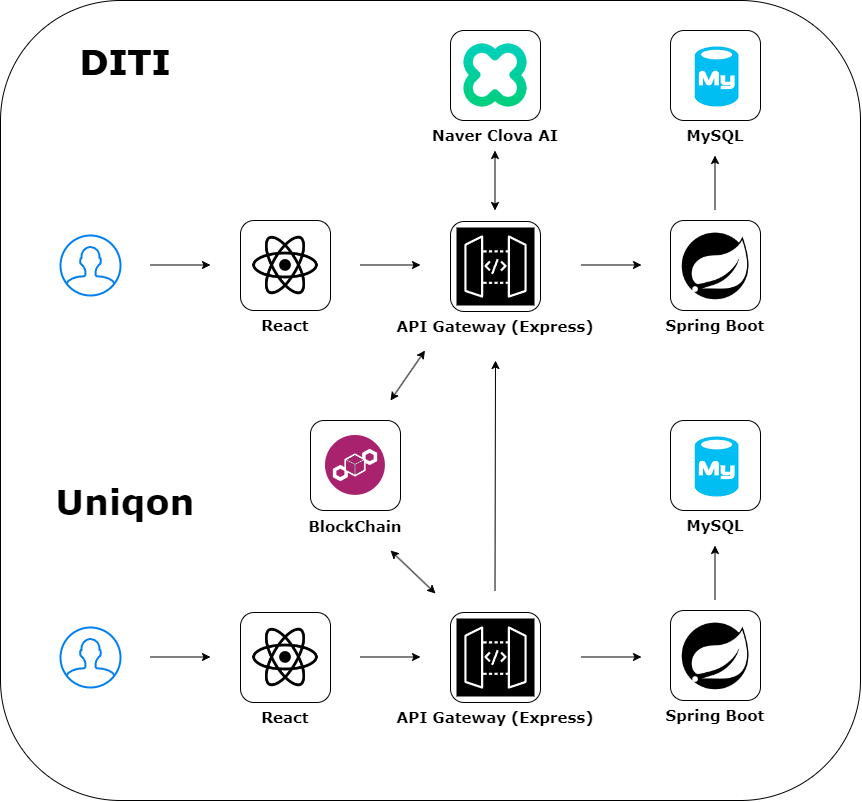

## ⚙ 기능소개

### DITI (Decentralized Identity Trust Infrastructure)

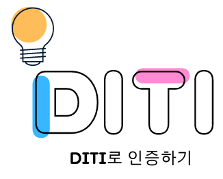

|                         메인화면 + 로그인                          |
| :----------------------------------------------------------------: |
| 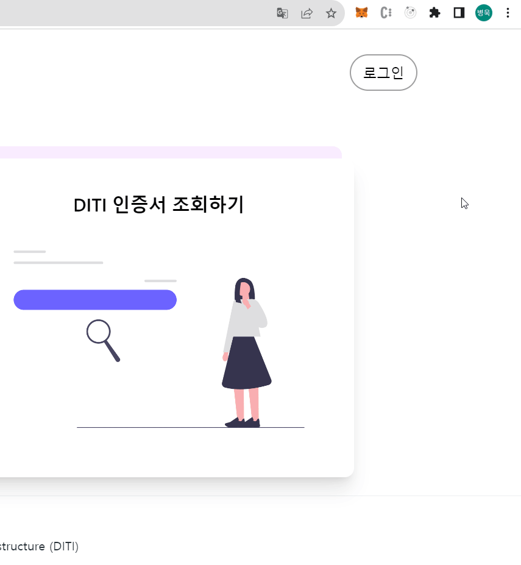 |

|                          VC 발급                           |
| :--------------------------------------------------------: |
| 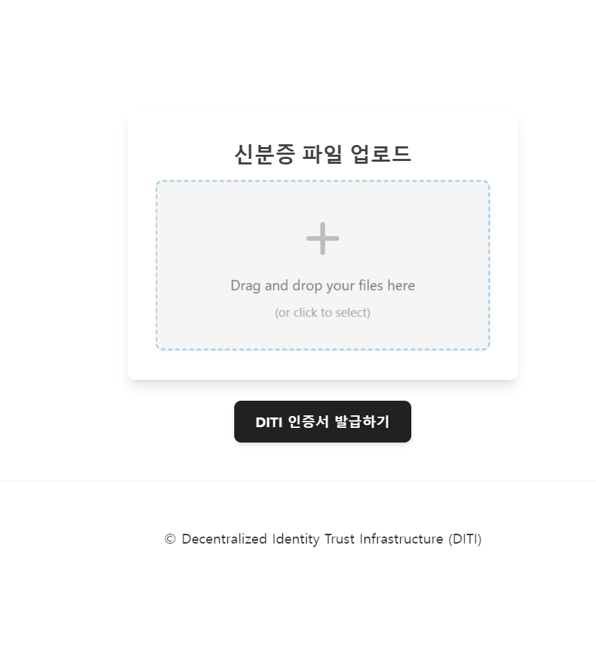 |

|                            VC 조회                             |
| :------------------------------------------------------------: |
|  |

### UNIQON (UNIQUE + ON)

|                          메인화면                           |
| :---------------------------------------------------------: |
| 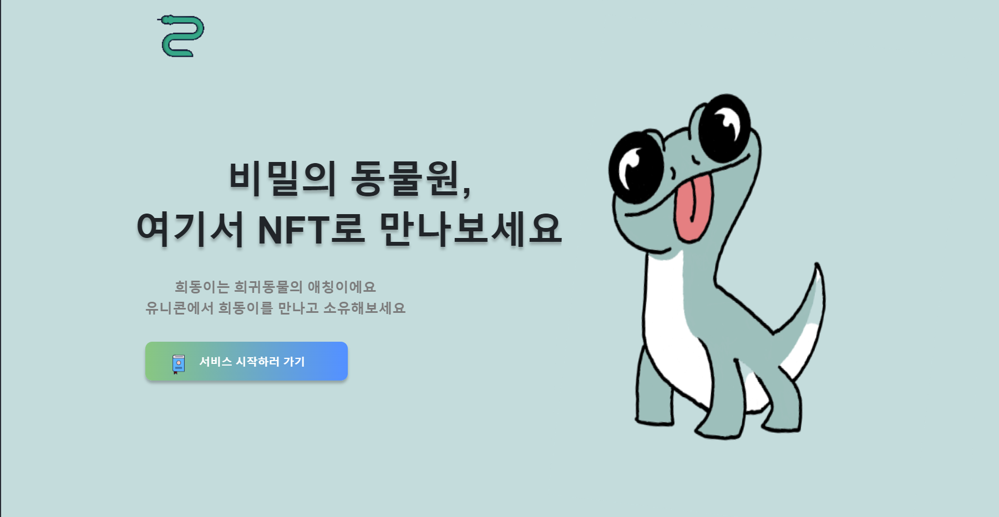 |

|                           로그인                            |
| :---------------------------------------------------------: |
|  |

|                            회원가입                             |
| :-------------------------------------------------------------: |
|  |

|                              AI 이미지 생성                               |
| :-----------------------------------------------------------------------: |
| 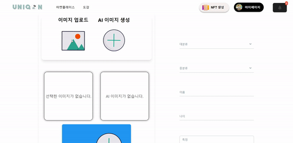 |

|                            nft발급                             |
| :------------------------------------------------------------: |
| 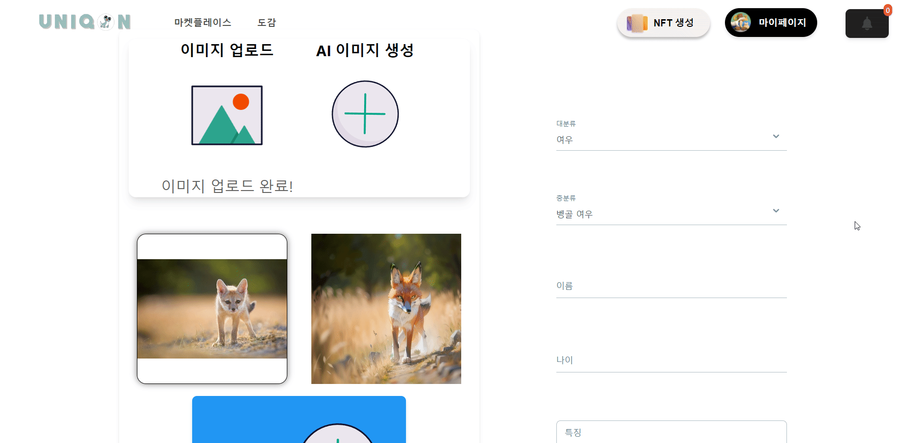 |

|                          도감                           |
| :-----------------------------------------------------: |
|  |

|                             도감 좋아요                             |
| :-----------------------------------------------------------------: |
| 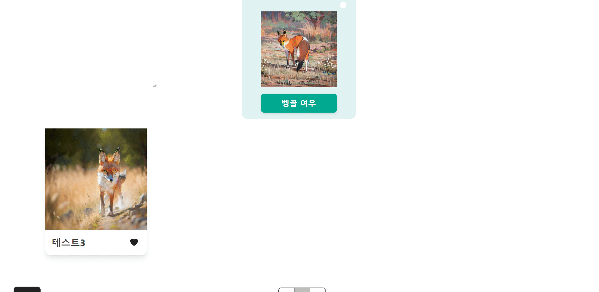 |

|                             판매글 등록                              |
| :------------------------------------------------------------------: |
|  |

|                            NFT 구매                            |
| :------------------------------------------------------------: |
|  |

|                               판매 알림                               |
| :-------------------------------------------------------------------: |
|  |

|                           내 정보                           |
| :---------------------------------------------------------: |
| 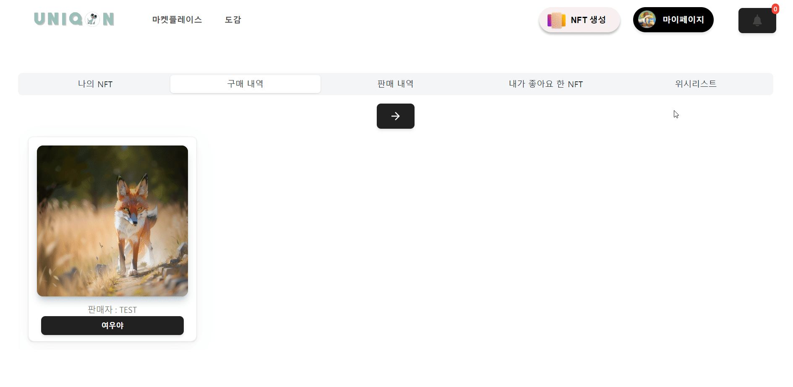 |

|                             닉네임 변경                             |
| :-----------------------------------------------------------------: |
| 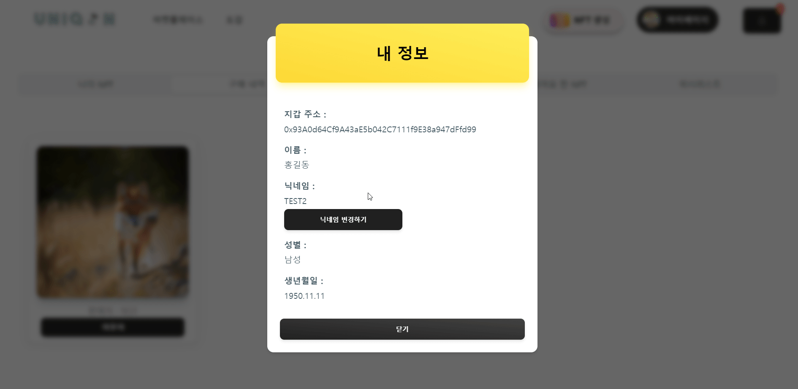 |

